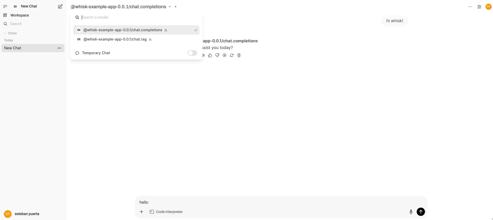

# Whisk 🥄⚡

**"Whisk – Effortless AI Microservices: Turn Your AI Logic into an OpenAI-Compatible API in Minutes."** 🚀

Whisk is a flexible runtime framework for building AI applications with support for chat, file storage, and more. It provides a FastAPI-based HTTP API and easy-to-use handler system so you can focus on building your AI logic. 

* OpenWebUI compatible
* OpenAI compatible
* FastAPI compatible
* Dependency injection
* Easy to use
* Easy to deploy
* Easy to scale

Turn your AI functions into model-like APIs with a simple decorator:

```python
from whisk.kitchenai_sdk.kitchenai import KitchenAIApp
from whisk.kitchenai_sdk.http_schema import (
    ChatCompletionRequest,
    ChatCompletionResponse,
    ChatCompletionChoice,
    ChatResponseMessage
)

# Initialize the app
kitchen = KitchenAIApp(namespace="whisk-example-app")

@kitchen.chat.handler("chat.completions")
async def handle_chat(request: ChatCompletionRequest) -> ChatCompletionResponse:
    """Simple chat handler that echoes back the last message"""
    return ChatCompletionResponse(
        model=request.model,
        choices=[
            ChatCompletionChoice(
                index=0,
                message=ChatResponseMessage(
                    role="assistant",
                    content=f"Echo: {request.messages[-1].content}"
                ),
                finish_reason="stop"
            )
        ]
    )
```

Now your handler can be called like a regular OpenAI endpoint:

```python
response = client.chat.completions.create(
    model="@whisk-example-app-0.0.1/chat.completions",
    messages=[{"role": "user", "content": "Hello!"}],
    metadata={"user_id": "123"},
)
```

### RAG-enabled Chat Handler

```python
from whisk.kitchenai_sdk.schema import (
    ChatInput, 
    ChatResponse,
    DependencyType,
    SourceNode
)

@kitchen.chat.handler("chat.rag", DependencyType.VECTOR_STORE, DependencyType.LLM)
async def rag_handler(chat: ChatInput, vector_store, llm) -> ChatResponse:
    """RAG-enabled chat handler"""
    # Get the user's question
    question = chat.messages[-1].content
    
    # Search for relevant documents
    retriever = vector_store.as_retriever(similarity_top_k=2)
    nodes = retriever.retrieve(question)
    
    # Create context from retrieved documents
    context = "\n".join(node.node.text for node in nodes)
    prompt = f"""Answer based on context: {context}\nQuestion: {question}"""
    
    # Get response from LLM
    response = await llm.acomplete(prompt)
    
    # Return response with sources
    return ChatResponse(
        content=response.text,
        sources=[
            SourceNode(
                text=node.node.text,
                metadata=node.node.metadata,
                score=node.score
            ) for node in nodes
        ]
    )
```

### Storage Handler

```python
from whisk.kitchenai_sdk.schema import (
    WhiskStorageSchema,
    WhiskStorageResponseSchema
)

@kitchen.storage.handler("storage")
async def storage_handler(data: WhiskStorageSchema) -> WhiskStorageResponseSchema:
    """Storage handler for document ingestion"""
    if data.action == "list":
        return WhiskStorageResponseSchema(
            id=int(time.time()),
            name="list",
            files=[]
        )
        
    if data.action == "upload":
        return WhiskStorageResponseSchema(
            id=int(time.time()),
            name=data.filename,
            label=data.model.split('/')[-1],
            metadata={
                "namespace": data.model.split('/')[0],
                "model": data.model
            },
            created_at=int(time.time())
        )
```

## Running Your App

```python
from whisk.config import WhiskConfig, ServerConfig
from whisk.router import WhiskRouter

# Configure and create router
config = WhiskConfig(server=ServerConfig(type="fastapi"))
router = WhiskRouter(kitchen_app=kitchen, config=config)

# Run the server
router.run(host="0.0.0.0", port=8000)
```




## Installation

```bash
pip install kitchenai-whisk
```

## Quick Start

```python
from whisk.kitchenai_sdk.kitchenai import KitchenAIApp
from whisk.config import WhiskConfig, ServerConfig, FastAPIConfig
from whisk.router import WhiskRouter

# Create app
app = KitchenAIApp(namespace="my-app")

# Add a chat handler
@app.chat.handler("my-model")
async def handle_chat(request):
    return {
        "choices": [{
            "message": {"role": "assistant", "content": "Hello!"},
            "finish_reason": "stop"
        }]
    }

# Configure and run
config = WhiskConfig(
    server=ServerConfig(
        type="fastapi",
        fastapi=FastAPIConfig(
            host="0.0.0.0",
            port=8000,
            prefix="/v1"
        )
    )
)

router = WhiskRouter(app, config)
router.run()
```

## Handler Types

### Chat Handlers

```python
@app.chat.handler("chat.completions")
async def handle_chat(request):
    """Handle chat completions"""
    messages = request.messages
    response = await your_llm(messages)
    return {
        "choices": [{
            "message": {"role": "assistant", "content": response},
            "finish_reason": "stop"
        }]
    }
```

### Storage Handlers

```python
@app.storage.handler("local")
async def handle_storage(request):
    """Handle file storage"""
    if request.action == "upload":
        # Handle file upload
        return {
            "id": "file-123",
            "name": request.filename,
            "created_at": int(time.time())
        }
    elif request.action == "list":
        # Return file list
        return {
            "files": [
                {"id": 1, "name": "file1.txt"},
                {"id": 2, "name": "file2.txt"}
            ]
        }
```


## Customizing FastAPI

### Using Your Own FastAPI App

```python
from fastapi import FastAPI, Depends
from fastapi.security import OAuth2PasswordBearer
from whisk.kitchenai_sdk.kitchenai import KitchenAIApp
from whisk.config import WhiskConfig
from whisk.router import WhiskRouter

# Create your KitchenAI app
kitchen_app = KitchenAIApp(namespace="my-app")

# Add your handlers
@kitchen_app.chat.handler("my-model")
async def handle_chat(request):
    return {"response": "Hello!"}

# Create your FastAPI app with custom auth
fastapi_app = FastAPI()
oauth2_scheme = OAuth2PasswordBearer(tokenUrl="token")

@fastapi_app.post("/token")
async def login():
    return {"access_token": "secret"}

async def get_current_user(token: str = Depends(oauth2_scheme)):
    if token != "secret":
        raise HTTPException(status_code=401)
    return {"user": token}

# Add custom routes before Whisk setup
@fastapi_app.get("/custom", dependencies=[Depends(get_current_user)])
async def custom_route():
    return {"message": "Authenticated route"}

# Create WhiskRouter with your FastAPI app
config = WhiskConfig(server=ServerConfig(type="fastapi"))
router = WhiskRouter(
    kitchen_app=kitchen_app, 
    config=config,
    fastapi_app=fastapi_app  # Pass your custom app
)

# Run the server
router.run()
```

### Using Setup Callbacks

```python
def before_setup(app: FastAPI):
    """Add routes/middleware before Whisk setup"""
    # Add auth
    oauth2_scheme = OAuth2PasswordBearer(tokenUrl="token")
    
    @app.post("/token")
    async def login():
        return {"access_token": "secret"}

    # Add custom middleware
    @app.middleware("http")
    async def add_custom_header(request, call_next):
        response = await call_next(request)
        response.headers["Custom"] = "Value"
        return response

def after_setup(app: FastAPI):
    """Add routes after Whisk setup"""
    @app.get("/health")
    async def health_check():
        return {"status": "healthy"}

# Create router with callbacks
router = WhiskRouter(
    kitchen_app=kitchen_app,
    config=config,
    before_setup=before_setup,  # Runs before Whisk routes
    after_setup=after_setup    # Runs after Whisk routes
)

# Access FastAPI app directly if needed
app = router.app
```

### Running Programmatically

```python
# In a script
from whisk.router import WhiskRouter
from whisk.config import WhiskConfig, ServerConfig

# Create router
router = WhiskRouter(kitchen_app, config)

# Run with custom host/port
router.run(host="0.0.0.0", port=8000)

# In a Jupyter notebook
import nest_asyncio
nest_asyncio.apply()

router = WhiskRouter(kitchen_app, config)
router.run()
```

## CLI Usage

```bash
# Start server
whisk serve --config config.yaml

# Initialize new project
whisk init my-project

# Run with custom host/port
whisk serve --host 0.0.0.0 --port 8080
```

## Configuration

```yaml
# config.yaml
server:
  type: fastapi
  fastapi:
    host: 0.0.0.0
    port: 8000
    prefix: /v1

client:
  id: my-app
  type: bento_box
```

## Dependencies

Whisk supports dependency injection for handlers:

```python
from whisk.kitchenai_sdk.schema import DependencyType

# Register dependency
vector_store = MyVectorStore()
app.register_dependency(DependencyType.VECTOR_STORE, vector_store)

# Use in handler
@app.chat.handler("rag", DependencyType.VECTOR_STORE)
async def handle_rag(request, vector_store=None):
    # vector_store is automatically injected
    docs = await vector_store.search(request.messages[-1].content)
    return {"response": f"Found docs: {docs}"}
```

## Jupyter Notebook Usage

```python
import nest_asyncio
nest_asyncio.apply()

# Create and run
router = WhiskRouter(kitchen, config)
router.run()
```

## API Reference

The API follows OpenAI's API structure:

- `/v1/chat/completions` - Chat completions
- `/v1/files` - File operations
- `/v1/models` - List available models

## Contributing

Contributions welcome! Please read our [contributing guidelines](CONTRIBUTING.md).

## License

MIT License

Copyright (c) 2024 Whisk

Licensed under the Apache License, Version 2.0 (the "License");
you may not use this file except in compliance with the License.
You may obtain a copy of the License at

    http://www.apache.org/licenses/LICENSE-2.0

Unless required by applicable law or agreed to in writing, software
distributed under the License is distributed on an "AS IS" BASIS,
WITHOUT WARRANTIES OR CONDITIONS OF ANY KIND, either express or implied.
See the License for the specific language governing permissions and
limitations under the License.
